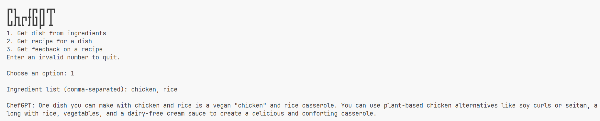
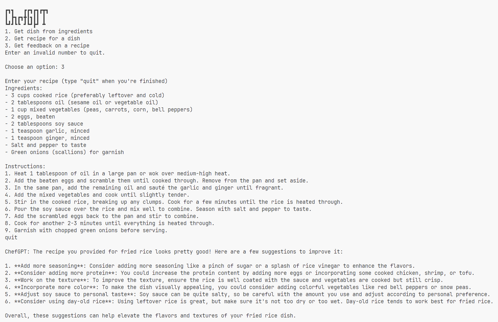

# ChefGPT

A chatbot for our culinary needs.

## Running the Code

1. Create a virtual environment.

    ```sh
    python -m venv chefgpt
    ```

2. Activate it.

   - Windows

     ```ps
       .\chefgpt\Scripts\Activate.ps1
     ```

   - Linux

     ```sh
     source chefgpt/Scripts/activate
     ```

3. Install dependencies.

   ```sh
   pip install -r requirements.txt
   ```

4. Run the program.

    - Without specialization:

      ```sh
      python main.py
      ```

    - With specialization:

      ```sh
      python main.py "<Specialization>"
      ```

      Basically, by passing a command line argument to the script, you can customize the chef. Here are some examples:

      ```sh
      python main.py "You are a Chinese chef and you specialize in the Chinese cuisine."
      python main.py "You are a Russian chef and you specialize in the Russian cuisine."
      python main.py "You are a vegan chef and you specialize in cooking vegan dishes."
      ```

## Features

1. Finds a dish that you can make using some given ingredients.

   Exception Handling: If no dish is possible with the given combination of ingredients, it'll be pointed out.

    

2. Generates a recipe for a dish.

   Exception Handling: If the input is not a dish, it'll be pointed out.

    

3. Gives feedback on the user's recipe.

   Exception Handling: If the input is not a recipe, it'll be pointed out.

    

## Specialization

Vegan chef suggesting a dish:



Vegan chef suggesting a recipe:


## Observations

- Whenever a valid recipe is inputted, the chatbot finds a way to make some improvements to it.
- The chatbot can identify irrelevant messages and decline to respond to them.

## Chain of Input

There are three AI bots performing actions of:

1. Ingredients to Dish
2. Dish to Recipe
3. Recipe Feedback

When I passed the output of bot #1 to bot #2, and then the output of that to bot #3, I found that:

Even though the recipe was generated by an AI bot, the bot #3 still found some areas of improvement, which was unexpected, as bot #2 provided a high quality recipe.


