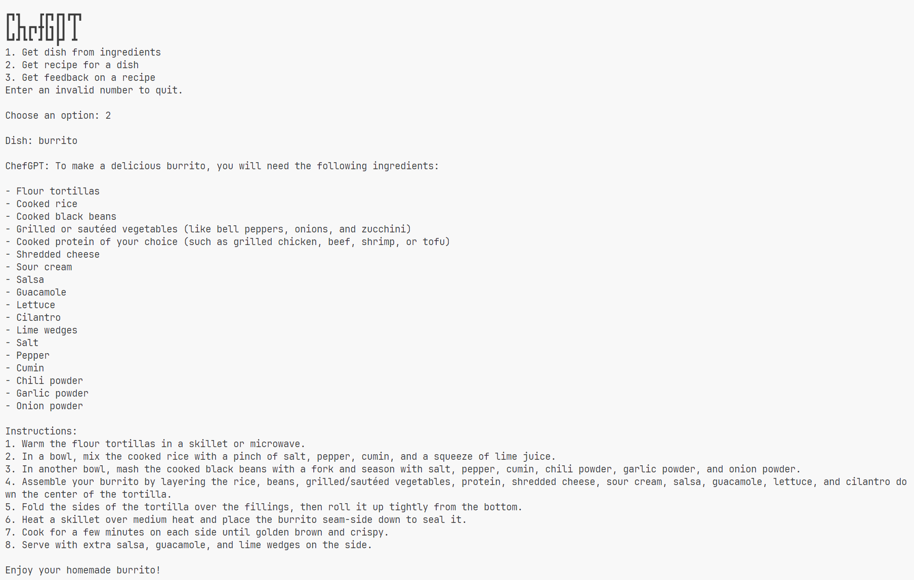

# ChefGPT

A chatbot for our culinary needs.

## Features

1. Ingredients to Dish
   Exception Handling: If no dish is possible with the given combination of ingredients, it'll be pointed out.

    

2. Dish to recipe
   Exception Handling: If the input is not a dish, it'll be pointed out.

    

3. Recipe feedback

   Exception Handling: If the input is not a recipe, it'll be pointed out.

    

## Observations

- Whenever a valid recipe is inputted, the chatbot finds a way to make some improvement to it.
- The chatbot can identify irrelevant messages and decline to respond to them.

## Running the Code

1. Create a virtual environment.

    ```sh
    python -m venv chefgpt
    ```

2. Activate it.

   - Windows

     ```ps
       .\chefgpt\Scripts\Activate.ps1
     ```

   - Linux

     ```sh
     source chefgpt/Scripts/activate
     ```

3. Install dependencies.

   ```sh
   pip install -r requirements.txt
   ```

4. Run the program.

   ```sh
   python main.py
   ```
