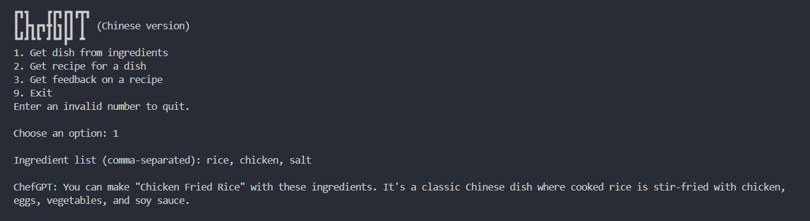
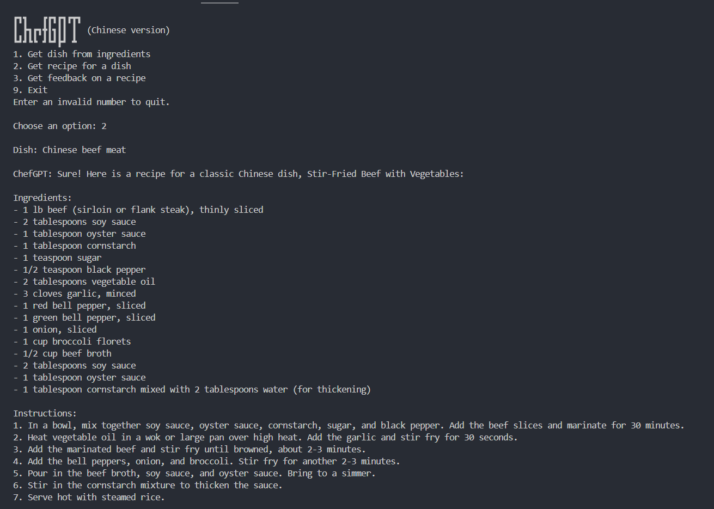
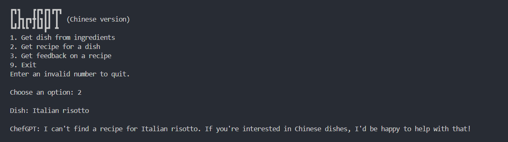

# ChefGPT

Chinese version

## Features

1. Finds a chinese dish that you can make using some given ingredients.

   Exception Handling: If no chinese dish is possible with the given combination of ingredients, it'll be pointed out.

   

2. Generates a recipe for a chinese dish. If dish is not chinese, then it would not be handled

   

   Exception Handling: If the input is not a dish, it'll be pointed out.

   

3. Gives feedback on the user's recipe.

   Exception Handling: If the input is not a recipe, it'll be pointed out.
